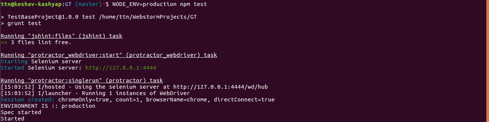
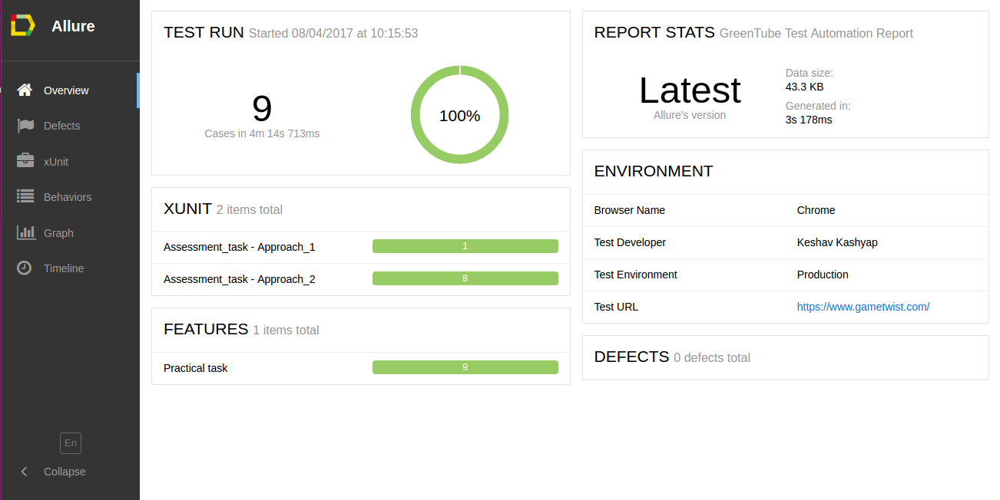
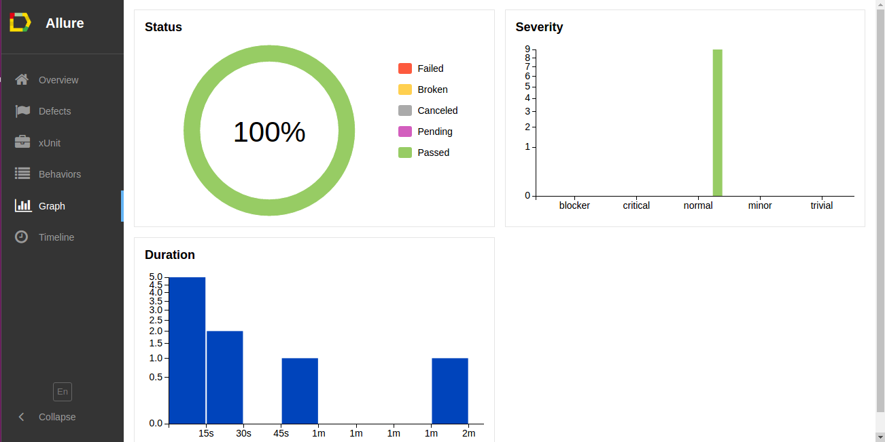
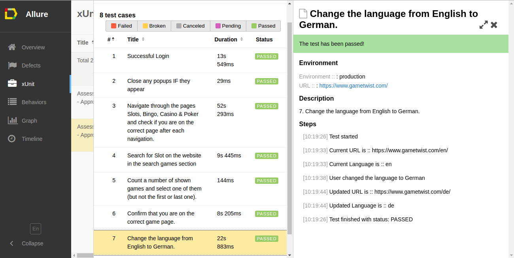

# GreenTube

## How to setup and run Functional Automation

### Pre-requisites:
  1.  **Java** should be installed on the system.

  2.  **Setup Node:**
  		For setting up protractor we have to run below mentioned command :-

       ``sudo apt-get install nodejs``

      As the nodejs package contains the nodejs binary as well as ``npm``, so we don't need to install ``npm`` separately.

  3. **Setup Maven:** To install maven we have to run below mentioned command :
  
       ``sudo apt-get install maven``

  4. **Download the Project from GIT:**

  	 ``git clone https://github.com/kkashyap1707/GameTwist.git ``

### Tools and Technologies Used :
  1. **Node Version** : ``node -v`` **(v6.9.1)**
  2. **npm Version** : ``npm -v`` **(3.10.8)**
  3. **Java Version** : ``java -version`` **(1.8.)**
  4. **Protractor Version**  : ``protractor --version`` **(Version 4.0.11)**
  5. **Maven Version**  : ``mvn --version`` **(Apache Maven 3.3.9)**
  6. **Framework** : Grunt + Jasmine  :
     - **Grunt** : ``grunt --version`` **(grunt-cli v1.2.0, grunt v1.0.1)** is a task-based command line build tool for JavaScript projects. It is a bunch of built-in tasks that will get you pretty far, with the ability to build your own plugins and scripts that extend the basic functionality.
     - **Jasmine** is a software project management and comprehension tool. It manages all dependencies and different flows for building a project.
  7. **End to End Functional testing using Protractor** :
 	 Protractor is an open source end to end testing framework to test AngularJS application. Protractor is a Node.js program built on top of WebDriverJS.

     Start up a selenium server. By default, the tests expect the selenium server to be running at http://localhost:4444/wd/hub. A selenium server can be started with webdriver-manager which is included in bin/webdriver-manager.

     ``webdriver-manager update``

     ``webdriver-manager start``

     Protractor's test suite runs against the included test application. Start that up with

     ``npm test``

  8. **Reporting:**
     Allure Reporting: Allure is a flexible, lightweight multi-language test report tool, with the possibility of adding to the report of additional information such as screenshots, logs and so on. It is a great degree simple to use and makes excellent execution reports.

### Execution Steps:
1. Extract the downloaded project from git
2. Open Terminal
3. Go to the project location
4. Enter the below mentioned commands to download the dependency of the project:
	**Download Dependency of Project** :  **``npm install``**
	On Successful compilation of the project it will download all the dependencies like (Grunt,Jshint,grunt-protractor-runner Allure Reporting etc.)
5. Enter the below mentioned command to update Selenium WebDriver
	**``npm run update``**
6. Enter the below mentioned commands to compile and run the whole project:
	**Run Project** : **``NODE_ENV=production npm test ``**
	In this case, you can specify Environment type. Environments type can be : production and QA
7. To run the specific module, we have to pass below mentioned command:
	**Run Specific Module** :  **``NODE_ENV=EnvironmentName npm run script-name``**
    **e.g.** :  **``NODE_ENV=production npm run login-test``**
   
   
**Sample** 

             

  |      Module Name         |                 Production             |                 QA             |
  | -------------------------|----------------------------------------|--------------------------------|
  | Regression Test          | NODE_ENV=production npm test           | NODE_ENV=QA npm test           |
  | Login                    | NODE_ENV=production npm run login-test | NODE_ENV=QA npm run login-test |
  | SANITY                   | NODE_ENV=production npm run sanity-test| NODE_ENV=QA npm run sanity-test|

### Steps to read the Functional Automation Execution Result (index.html) File :-
1. Go to the project directory
2. Go to ``/target/site/allure-maven-plugin/ ``
3. click on ``index.html`` file.
4. Once it will open, it looks like.

There are 5 sections of this report. All the 5 sections will be accessible by clicking on the tabs available on top left corner of the report.

   **Overview:** In this section we will see the overall summary of the execution report.
   **Defects:** In this section we will see the the defects found in during testing. It gives detailed list of defects revealed during test execution.
   **xUnit:** This section will display each suite individually. By clicking on any suite,we can view test statistics for each test suite and detailed information about every test case..
   **Behaviours:** This section will display feature and story-wise result. 
   **Graph:** This section will display graphical summary of the execution report.
   **Timeline:** This section will display time taken of test execution report.

             **Dashboard Report**

             **Graphical Report Report**

			 **Individual Test Report**
			 
			 